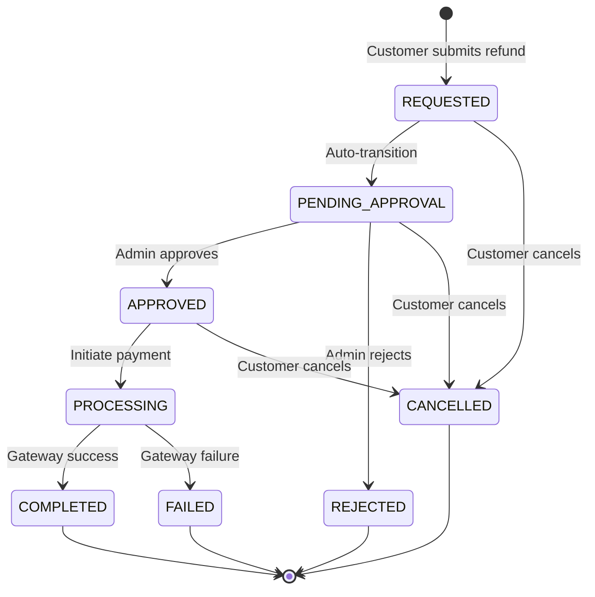
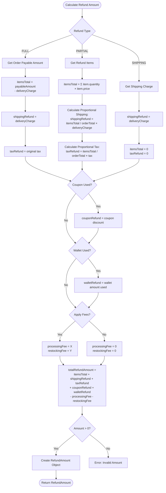
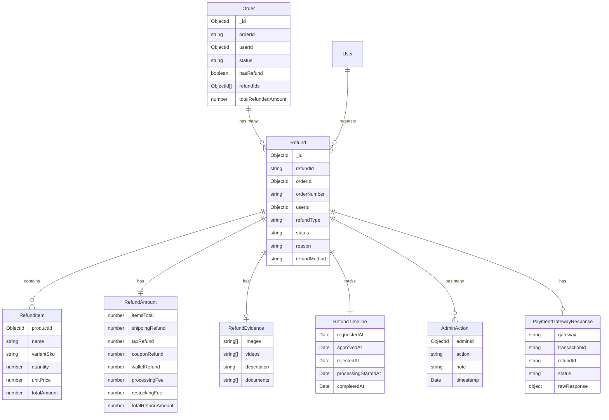
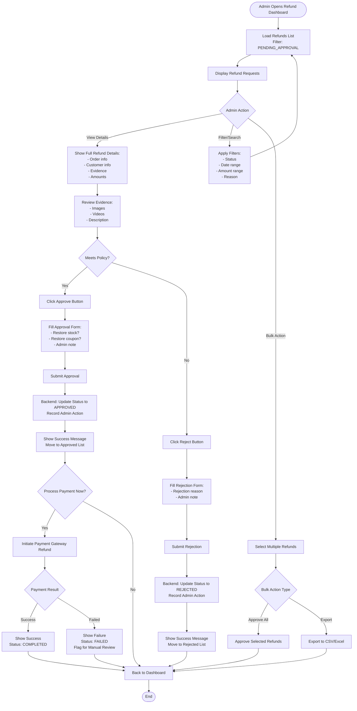
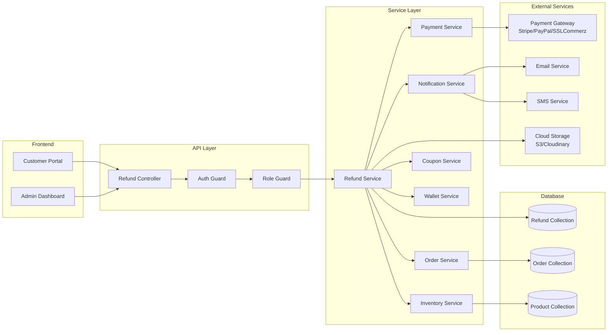

# Refund Workflow Diagrams

## Refund Status Flow



## Complete Refund Process Flow

```mermaid
flowchart TD
    Start([Customer Initiates Refund]) --> ValidateOrder{Order Valid?}
    ValidateOrder -->|No| Error1[Return Error]
    ValidateOrder -->|Yes| CheckEligibility{Eligible for Refund?}

    CheckEligibility -->|No| Error2[Return Error: Not Eligible]
    CheckEligibility -->|Yes| CheckType{Refund Type?}

    CheckType -->|FULL| CalcFull[Calculate Full Refund Amount]
    CheckType -->|PARTIAL| ValidateItems{Items Valid?}
    CheckType -->|SHIPPING| CalcShipping[Calculate Shipping Refund]

    ValidateItems -->|No| Error3[Return Error: Invalid Items]
    ValidateItems -->|Yes| CalcPartial[Calculate Partial Refund Amount]

    CalcFull --> CreateRefund[Create Refund Record<br/>Status: REQUESTED]
    CalcPartial --> CreateRefund
    CalcShipping --> CreateRefund

    CreateRefund --> UpdateOrder[Update Order hasRefund Flag]
    UpdateOrder --> NotifyCustomer1[Notify Customer: Request Received]
    NotifyCustomer1 --> PendingApproval[Status: PENDING_APPROVAL]

    PendingApproval --> AdminReview{Admin Review}

    AdminReview -->|Approve| RecordApproval[Record Admin Action<br/>Status: APPROVED]
    AdminReview -->|Reject| RecordRejection[Record Rejection Reason<br/>Status: REJECTED]

    RecordRejection --> NotifyRejected[Notify Customer: Rejected]
    NotifyRejected --> End1([End])

    RecordApproval --> RestoreStock{Restore Stock?}
    RestoreStock -->|Yes| UpdateInventory[Update Product Inventory]
    RestoreStock -->|No| RestoreCoupon{Restore Coupon?}
    UpdateInventory --> RestoreCoupon

    RestoreCoupon -->|Yes| UpdateCoupon[Mark Coupon Available]
    RestoreCoupon -->|No| NotifyApproved[Notify Customer: Approved]
    UpdateCoupon --> NotifyApproved

    NotifyApproved --> ApplyFees{Apply Fees?}
    ApplyFees -->|Yes| DeductFees[Deduct Processing/Restocking Fees]
    ApplyFees -->|No| InitiatePayment[Status: PROCESSING]
    DeductFees --> RecalcAmount[Recalculate Final Amount]
    RecalcAmount --> InitiatePayment

    InitiatePayment --> CallGateway[Call Payment Gateway API]
    CallGateway --> GatewayResponse{Gateway Response}

    GatewayResponse -->|Success| RecordSuccess[Store Gateway Response<br/>Status: COMPLETED]
    GatewayResponse -->|Failure| RecordFailure[Store Failure Reason<br/>Status: FAILED]

    RecordSuccess --> UpdateOrderRefund[Update Order:<br/>- Add to refundIds<br/>- Update totalRefundedAmount]
    UpdateOrderRefund --> UpdatePaymentStatus[Update Order Payment Status]
    UpdatePaymentStatus --> CreditWallet{Refund to Wallet?}

    CreditWallet -->|Yes| UpdateWallet[Credit User Wallet]
    CreditWallet -->|No| NotifyCompleted[Notify Customer: Completed]
    UpdateWallet --> NotifyCompleted
    NotifyCompleted --> End2([End: Success])

    RecordFailure --> NotifyFailed[Notify Admin: Manual Intervention]
    NotifyFailed --> End3([End: Failed])
```



## Refund Amount Calculation Flow



## Database Schema Relationships



## Admin Dashboard Flow



## Customer Refund Request Flow

```mermaid
flowchart TD
    Start([Customer Views Order]) --> CheckStatus{Order Status}
    CheckStatus -->|DELIVERED| ShowRefundButton[Show "Request Refund" Button]
    CheckStatus -->|Other| HideButton[Hide Refund Option]

    ShowRefundButton --> ClickRefund[Click Request Refund]
    ClickRefund --> SelectType{Select Refund Type}

    SelectType -->|Full Refund| FullForm[Show Full Refund Form]
    SelectType -->|Partial Refund| PartialForm[Show Item Selection]

    FullForm --> SelectReason[Select Refund Reason]
    PartialForm --> SelectItems[Select Items to Refund:<br/>- Choose products<br/>- Set quantities]

    SelectItems --> SelectReason
    SelectReason --> EnterDetails[Enter Reason Details<br/>Max 1000 characters]

    EnterDetails --> UploadEvidence{Upload Evidence?}
    UploadEvidence -->|Yes| UploadFiles[Upload:<br/>- Images<br/>- Videos<br/>- Documents]
    UploadEvidence -->|No| SelectMethod[Select Refund Method:<br/>- Original Payment<br/>- Wallet<br/>- Bank Transfer]

    UploadFiles --> SelectMethod
    SelectMethod --> ReviewSummary[Review Refund Summary:<br/>- Items<br/>- Amounts<br/>- Method]

    ReviewSummary --> ConfirmSubmit{Confirm?}
    ConfirmSubmit -->|No| EditForm[Edit Form]
    ConfirmSubmit -->|Yes| SubmitRequest[Submit Refund Request]

    EditForm --> SelectType
    SubmitRequest --> Validate{Validation}

    Validate -->|Failed| ShowErrors[Show Validation Errors]
    Validate -->|Success| CreateRecord[Create Refund Record<br/>Status: REQUESTED]

    ShowErrors --> EditForm
    CreateRecord --> SendNotification[Send Email/SMS Confirmation]
    SendNotification --> ShowSuccess[Show Success Message:<br/>"Refund request submitted<br/>Refund ID: #REF-12345"]

    ShowSuccess --> TrackRefund[Redirect to Track Refund Page]
    TrackRefund --> End([End])
```

## Integration Architecture


